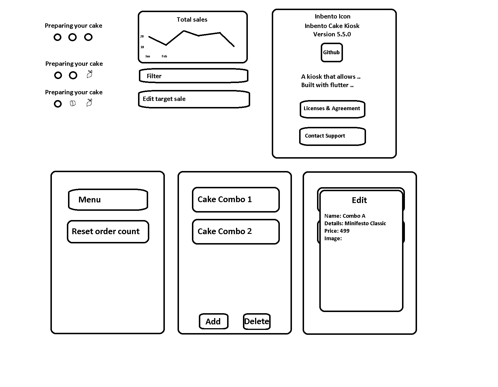
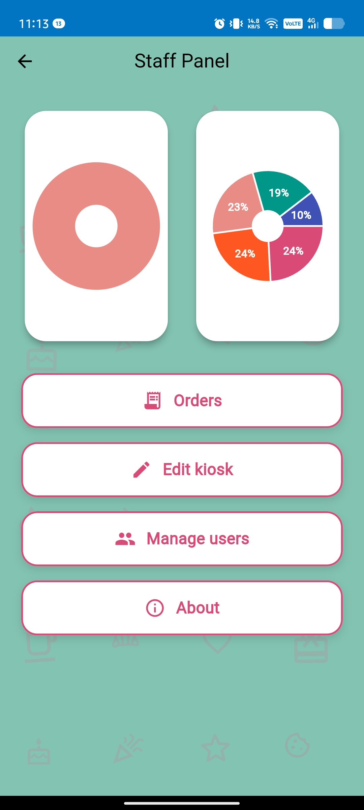
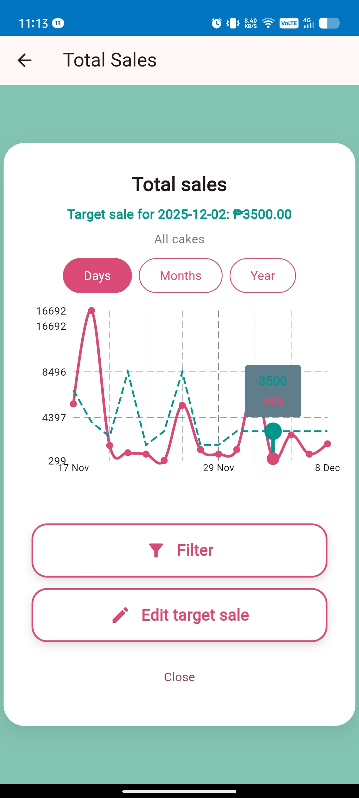
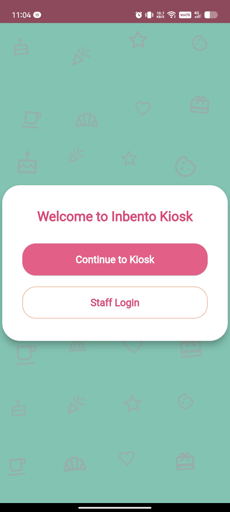
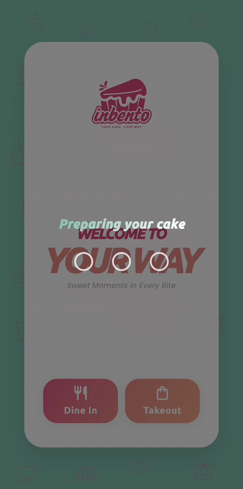

# In Bento Cake Kiosk

A Flutter-based kiosk application for ordering custom bento cakes.

## Overview

In Bento Cake Kiosk is a thesis project that revolutionizes the cake ordering experience by enabling customers to design and customize their own bento cakes through an intuitive digital kiosk interface. The application combines 3D visualization technology with real-time customization tools, allowing customers to create personalized cakes while viewing their designs from multiple angles. Built with Flutter for cross-platform deployment, the system includes both a customer-facing kiosk interface and a comprehensive staff management panel for order processing and business analytics.

## Features

### Customer Kiosk
- **3D Cake Customization** - Interactive 3D models for visualizing custom cakes
- **Personalized Decorations** - Draw or write custom dedications directly on cakes
- **QR Code Payments** - Scan-to-pay integration for seamless transactions
- **Web Accessible** - Access from any device with a web browser

### Staff Panel
- **Real-Time Order Management** - View and manage orders as they come in
- **Analytics Dashboard** - Monitor sales and orders through interactive charts
- **Menu Management** - Add, edit, or remove cake options and pricing
- **Multi-Device Support** - Manage operations from any location

## Screenshots

## Screenshots

### System Architecture
<p align="center">
  
</p>

### UI Designs
📄 [Font/Color etc (PDF)](Readme/inbento-cake-kiosk-icons.pdf)
📄 [Font/Color etc (PDF)](Readme/inbento-cake-kiosk-screens.pdf)
📄 [Log Documentation System](Readme/lds.pdf)
📄 [Log Documentation System](https://github.com/Ndkorr/log-documentation-system.git)

<p align="center">
  
  <br/>
  <em>UI Designs</em>
</p>

### Staff Management Panel
<p align="center">
  
  <br/>
  <em>Real-time order management and analytics</em>
</p>

### Order Analytics
<p align="center">
  
  <br/>
  <em>Track sales performance with interactive charts</em>
</p>

### Welcome Screen
<p align="center">
  
  <br/>
  <em>Welcome Screen</em>
</p>

### Animations
<p align="center">
  
  <br/>
  <em>Loading Animation</em>
</p>

<p align="center">
  
  <br/>
  <em>Promo/Screensaver Animation</em>
</p>

<p align="center">
  
  <br/>
  <em>Welcome Animation</em>
</p>


## Prerequisites

- Flutter SDK (version 3.1.0 or higher)
- Dart SDK (version 3.1.0 or higher)
- VSCode or Android Studio (for both web and mobile development)
- Xcode (for ios build, macOS only)
- Tinkercad or any 3D modeling software (for 3d model creation)
- draw.io (for creating flowchart of the system)
- LDS (for personal documentation)
- Canva (for overall ui/image creation including font style used etc)
- MS Paint (for designing ui)

## Installation

1. Clone the repository:
   ```bash
   git clone [repository-url]
   ```

2. Navigate to the project directory:
   ```bash
   cd in-bento-cake-kiosk/in_bento_kiosk
   ```

3. Install dependencies:
   ```bash
   flutter pub get
   ```

4. Configure Firebase:
   - Create a Firebase project at [Firebase Console](https://console.firebase.google.com/)
   - Add your app to the Firebase project
   - Download and add `google-services.json` (Android) and `GoogleService-Info.plist` (iOS)
   - Enable Cloud Firestore in your Firebase project

5. Configure ImgBB API:
   - Get your API key from [ImgBB API](https://api.imgbb.com/)
   - Add your API key to the project configuration

6. Run the app:
   ```bash
   flutter run
   ```

## Project Structure

```
assets/
├── cake_layers/     # Contains 3d model of the cake
├── icons/           # Icon that used on the app
└── images/          # screen and menu cake images

lib/
├── screens/         # UI screens
├── utils/           # Utility functions
├── theme/           # Overall theme of the app
└── main.dart        # App entry point
```

## Configuration

### Firebase Setup
- `google-services.json` (Android): Place in `android/app/`
- `GoogleService-Info.plist` (iOS): Place in `ios/Runner/`

### API Keys
- **ImgBB API**: Used for image hosting and storage
- **Firebase**: Used for backend data storage and real-time database

## Usage

Provide instructions on how to use the application.


## Technologies Used

- Flutter SDK (3.1.0+)
- Dart (3.1.0+)
- **Firebase Core** (^2.24.2) - Firebase integration
- **Cloud Firestore** (^4.13.5) - NoSQL cloud database
- **ImgBB API** - Image hosting service
- Google Fonts (^6.2.0)
- Model Viewer Plus (^1.7.0) - 3D model rendering
- FL Chart (^0.66.0) - Charts and graphs
- QR Flutter (^4.1.0) - QR code generation
- Shimmer (^3.0.0) - Loading animations
- Flutter SVG (^2.1.0) - SVG rendering
- URL Launcher (^6.2.6) - External URL handling
- File Picker (^8.1.4) - File selection
- HTTP (^1.6.0) - Network requests
- Intl (^0.18.0) - Internationalization

## Building for Production

### Android
```bash
flutter build apk --release
```

### iOS
```bash
flutter build ios --release
```

### Web
```bash
flutter build web --release
```

## License

Specify your license here.

## Contact

Your contact information or support channels.

## Acknowledgments

Credit any resources, libraries, or individuals who helped.